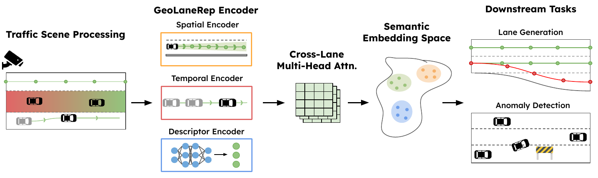

<h1 align="center">GeoLaneRep: Behavior-grounded Lane Representation Learning for Traffic Digital Twins</h1>

GeoLaneRep encodes static lane geometry, observed vehicle trajectories, and operational descriptors into a single shared cross-camera embedding. The encoder is trained jointly with contrastive cross-camera alignment, auxiliary role supervision, and temporal anomaly detection.

<p align="center">

</p>


The same embedding supports three downstream tasks through one set of weights:

1. **Zero-shot cross-camera lane matching** — match a query lane from an unseen camera to a reference bank.
2. **Per-window anomaly detection** — flag behavioral shifts on a GRU over the temporal embedding sequence.
3. **Behavior-conditioned geometry generation** — synthesize lane geometries that satisfy a target operational specification via a FiLM-conditioned diffusion module.

Trained on 16 roadside cameras / 132 lanes / 38 lane groups / 104,415 trajectories from the 511 Wisconsin feed.

## Setup

```bash
uv sync
```

**Requirements:**

- Python ≥3.13 and CUDA 12.4 wheels for `torch` (pinned in `uv.lock`).
- **SUMO** as a system dependency (the Python `sumolib` package wraps the `sumo` binary, but does not install it). On Debian/Ubuntu: `sudo apt install sumo sumo-tools sumo-doc`. Other platforms: see https://sumo.dlr.de/docs/Installing/.
- **YOLO weights** — `yolo11n.pt` is auto-downloaded by `ultralytics` on first use of `make extract`, into the repo root (gitignored).
- **Datasets** at `./dataset/` (raw camera videos + per-camera annotation JSON). Not bundled with the repo — see [`docs/dataset.md`](docs/dataset.md) for the expected layout and how to acquire/prepare each piece.
- **[Lanelet-Annotator](https://github.com/raynbowy23/Lanelet-Annotator)** — companion GUI used to draw the per-camera `annotation.json` files. Clone it as a sibling of this repo (or override `ANNOT_DIR` in the Makefile) and launch with `make annotate`.

**Disk footprint** of a full run is roughly:

- `results/preprocess/` ≈ 1 GB (extracted trajectories for 16 cameras)
- `results/preprocessing/lane_assignment/` ≈ 500 MB
- `results/joint_encoder/` + `results/lane_contrastive/` + `results/generation/` ≈ 400 MB combined (checkpoints + figures)
- `results/mlruns/` — small per run (≈ MB-scale: metrics, params, history JSONs). Grows with training history; safe to delete between training rounds if disk is tight.

Everything under `results/` is gitignored.

## Quick start

```bash
# 1. preprocessing: video → trajectories → lane assignment
make extract
make assign

# 2. train the encoder (Stage 1 contrastive, then Stage 2 joint)
make train CONFIG=configs/lane_contrastive.yaml
make train-joint CHECKPOINT=results/lane_contrastive/checkpoints/best.pt

# 3. train the generation models (baseline + relational diffusion)
make train-generation-relational-scratch

# 4. one-shot comparison table (Table 1 in the paper)
make comparison-table
```

`make help` lists every target.

## Documentation

- **[`docs/dataset.md`](docs/dataset.md)** — dataset layout, annotation schema, how to prepare a new camera
- **[`docs/reproduce.md`](docs/reproduce.md)** — paper figure/table → make-command map
- **[`docs/architecture.md`](docs/architecture.md)** — pipeline / system-level overview
- **[`docs/scripts_overview.md`](docs/scripts_overview.md)** — what each script in `scripts/` does
- **[`docs/src_overview.md`](docs/src_overview.md)** — what each module in `src/` does
- **[`docs/problem_method.md`](docs/problem_method.md)** — markdown port of paper §3–§4
- **[`docs/future_improvements.md`](docs/future_improvements.md)** — open items from the paper's limitations + implementation-level ideas

The chapter-5 GeoLane-Twin experiment pipeline lives under `.twin/` (gitignored); see `.twin/README.md` for its layout. It is not part of the GeoLaneRep paper release.

## Repository layout

```
scripts/        CLI entry points (training, evaluation, figures, preprocessing)
src/            library modules (models, data, generation, bridge, training)
configs/        YAML configs
results/        outputs of every pipeline stage (gitignored)
docs/           markdown documentation
Makefile        canonical workflow targets
```

## Citation

Will be added.

## License

Apache-2.0. See `LICENSE`.
